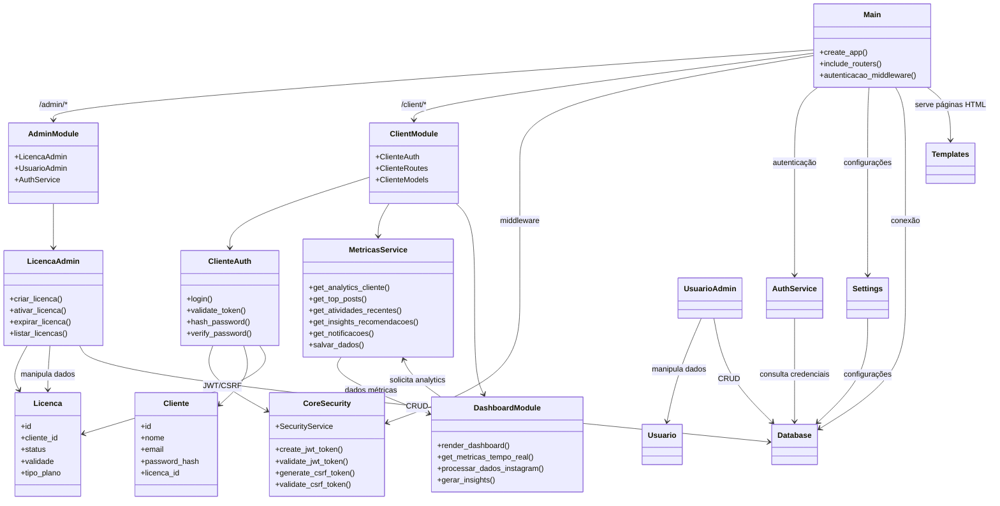
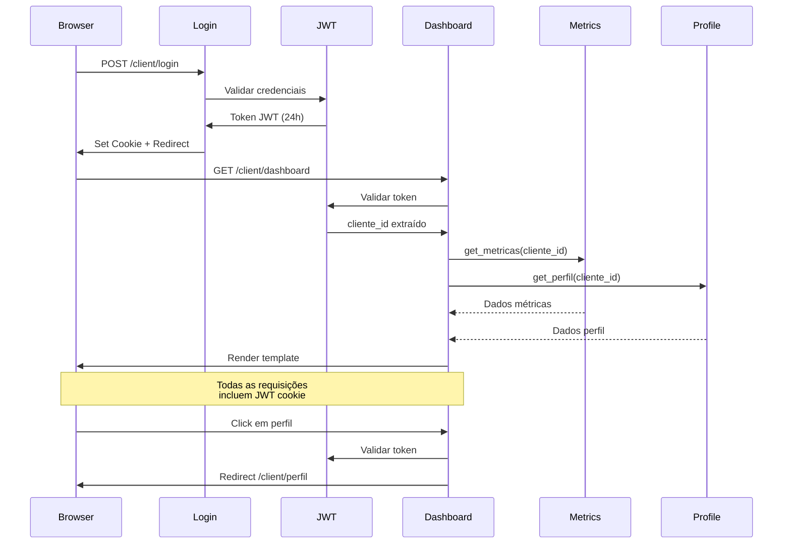

# Arquitetura do Sistema - integra-instagran

## Visão Geral

Sistema multi-tenant FastAPI com arquitetura modular para analytics de redes sociais. Suporta portais administrativo e de clientes com isolamento seguro de dados.

## Diagrama de Arquitetura Atualizado

## Arquitetura

- Multi Tenant: segregação lógica de dados e configurações por cliente
- Portal administrativo: gestão de licenças e administração do produto
- Portal do cliente: administração de dados, configurações e relatórios
- Integração segura com APIs externas, com chaves isoladas por cliente
- Preferência por Python e frameworks web modernos (FastAPI, Django, Flask)
- Estrutura portável para cloud (Docker, variáveis de ambiente)

### Sistema de Métricas e Dashboard

**Componentes Implementados (FEAT-005):**

1. **Dashboard Cliente** (`src/client/templates/dashboard.html`)
   - Interface com 6 seções principais
   - Métricas cards interativas
   - Gráficos de progresso circulares
   - Timeline de atividades
   - Sistema de notificações

2. **Serviço de Métricas** (`src/client/metricas_service.py`)
   - Classe MetricasService centralizada
   - 8 modelos de dados (PostMetrica, AnalyticsCliente, etc.)
   - Geração e persistência de dados
   - Cache para otimização

3. **Modelos Pydantic** (`src/client/models.py`)
   - Validação automática de dados
   - Cálculos de métricas
   - Enums para categorização

**Fluxo de Dados:**

1. Cliente acessa dashboard
2. MetricasService solicita dados do Instagram API
3. Dados processados e salvos em cache
4. Dashboard renderiza métricas em tempo real
5. Insights automáticos gerados
6. Notificações de performance enviadas

**Status:** ✅ CONCLUÍDO - 02/11/2025

### Fluxo de Autenticação JWT → Dashboard

**Componentes do Fluxo:**

1. **Login (`src/client/routes.py:login`)**
   - Valida credenciais do cliente
   - Verifica licença ativa
   - Gera JWT token com cliente_id
   - Define cookie HttpOnly seguro

2. **JWT Middleware (`src/client/auth.py`)**
   - Valida token em cada requisição
   - Extrai cliente_id do payload
   - Verifica expiração (24h)
   - Protege rotas com @jwt_required

3. **Dashboard Route (`src/client/routes.py:dashboard`)**
   - Recebe cliente_id validado
   - Busca métricas do serviço
   - Busca perfil do cliente
   - Renderiza template com contexto

4. **Serviços (`src/client/services/`)**
   - `metricas_service.py`: Dados de performance
   - `perfil_service.py`: Dados corporativos
   - Isolamento por cliente_id

**Segurança Implementada:**

- ✅ JWT com expiração de 24h
- ✅ Cookie HttpOnly (não acessível via JS)
- ✅ CSRF token validation
- ✅ Multi-tenant isolation por cliente_id
- ✅ Session tracking (último_acesso)

## Padrões de Código
