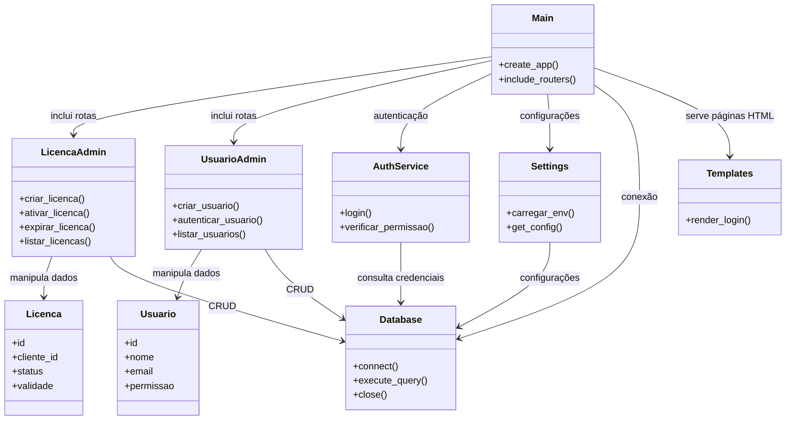

# Diagrama Visual da Arquitetura

# Arquitetura

- Multi Tenant: segregação lógica de dados e configurações por cliente
- Portal administrativo: gestão de licenças e administração do produto
- Portal do cliente: administração de dados, configurações e relatórios
- Integração segura com APIs externas, com chaves isoladas por cliente
- Preferência por Python e frameworks web modernos (FastAPI, Django, Flask)
- Estrutura portável para cloud (Docker, variáveis de ambiente)
